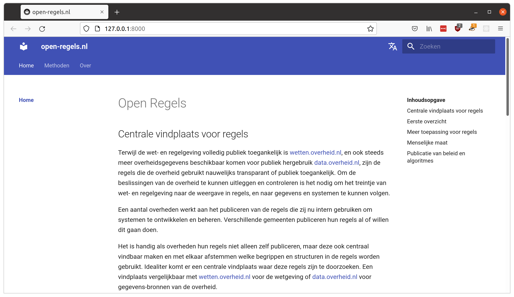

# Introduction

In 2021 Utrecht started developing the [Virtual Income Desk](https://opensource.pleio.nl/news/view/bc7443c1-483c-4aca-8a8f-16f2a954ff4f/het-virtueel-inkomstenloket) with Open Rules. An initiative with the aim for citizens to always and easily receive all financial regulations to which citizens are entitled.

For the realization of this goal, standards of the [NORA guideline rule management](https://www.noraonline.nl/wiki/Leidraad_Regelbeheer) have been used. The publication of these standardized rules for the Virtual Income Desk have been published [here](https://open-regels.nl/en/methoden/ALEF/).

Rules management is applied in various ways by organizations. A constant shared by all organizations is the need to implement the law according to the interpretation intended by the legislator, to act in accordance with the principles of good administration and to be able to adapt implementation as smoothly as possible to new insights from politics.

By applying rule management, the aim is to achieve the following “business” goals:

- **Law** - the implementation is in accordance with laws and regulations
- **Consistent** – regardless of channel, laws and regulations are implemented in the same way
- **Explainable** – the why/right to exist of a service, the rules used in the performance of the service, the individual decision and the intention of the law are available and clear to the customer
- **Manoeuvrable** – the implementing organization is able to implement changes in legislation and regulations in a timely manner in the various operational components of the organization.

Ultimately, we want to offer a new government-wide rule management library that includes information on product launches, rules management implementation support, best practices, and publishing of rules specifications.

This [open-regels.nl](https://open-regels.nl) website is a community initiative in preparation for the yet-to-be-obtained assignment from the Ministry of the Interior and Kingdom Relations to publish this new library on [regels.overheid.nl](https://regels.overheid.nl).

Do you have any questions or do you want to work with us? Please contact [Steven Gort](https://gitlab.com/datafluisteraar)

# MkDocs

[MkDocs](https://www.mkdocs.org/) is a fast, simple and downright gorgeous static site generator that's geared towards building project documentation. Documentation source files are written in Markdown, and configured with a single YAML configuration file.

## Material for MkDocs

[Material for MkDocs](https://squidfunk.github.io/mkdocs-material/) is a theme for MkDocs, a static site generator geared towards (technical) project documentation.

Material was used to realize the first version of [open-regels.nl](https://open-regels.nl).

# MkDocs static i18 plugin

Because we think it is important to be bilingual from scratch (Dutch and English), we use the [MkDocs static i18n plugin](https://github.com/ultrabug/mkdocs-static-i18n/). The `mkdocs-static-i18n` plugin allows you to support multiple languages of your documentation by adding static translation files to your existing documentation pages.

# Building the site

MkDocs comes with a built-in dev-server that lets you preview your documentation as you work on it. Make sure you're in the same directory as the mkdocs.yml configuration file, and then start the server by running the mkdocs serve command:

```
steven@steven-Surface-Laptop-3 ~/Development/Openregels (master) $ mkdocs serve
INFO     -  Building documentation...
INFO     -  Setting the default 'theme.language' option to 'nl'
INFO     -  Cleaning site directory
INFO     -  Translated navigation to en
INFO     -  Documentation built in 0.58 seconds
INFO     -  [11:32:59] Serving on http://127.0.0.1:8000/
```
Open up http://127.0.0.1:8000/ in your browser, and you'll see the default home page being displayed:



That's looking good. We now need to build the site:

```
steven@steven-Surface-Laptop-3 ~/Development/Openregels (master) $ mkdocs build
```

When building our site all of the files are written to the directory assigned to the `site` dir. Generally, you will simply need to copy the contents of that directory to the root directory of a hosting provider's server. Depending on your hosting provider's setup, you may need to use a graphical or command line ftp, ssh or scp client to transfer the files.

However, for our site we use a separate [git repo](https://gitlab.com/commonground/virtueel-inkomstenloket/regels) which we update with the `site` content and then use `git pull` from the root dir on the hosting provider's server.