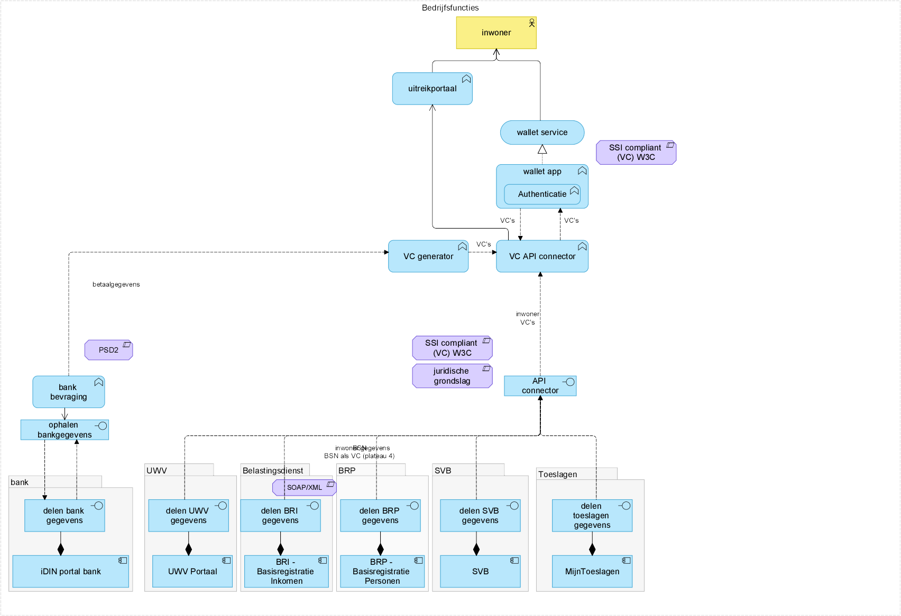
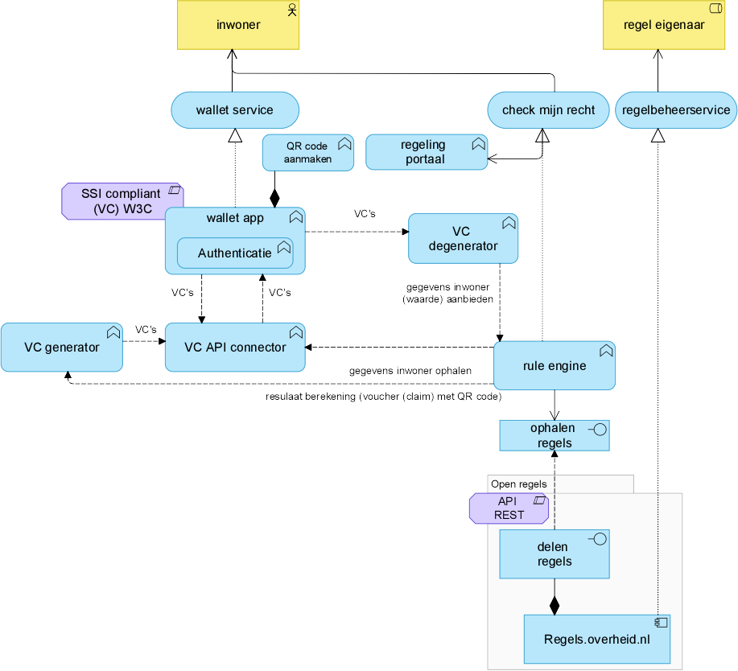

# Eind situatie “onze droom”

Hoe ziet ons “droom loket” er uit?

Onderstaande stappen kunnen op elk moment uitgevoerd worden door de inwoner, wanneer het uitkomt

## Stap 2. Haal gegevens op in wallet
1. Inwoner haalt gegevens op in uitreik portaal. Inwoner drukt op “ophalen gegevens” in het uitreik portaal, er komt een QR code
2. QR code wordt gescand en de gegevens worden opgehaald middels de “VC API Connector”
3. De (nieuwe) gegevens (VC’s) van de inwoner worden met “VC API Connector” middels bankbevraging én bevraging basisadministraties (die VC’s aanbieden in plateau 4) opgehaald: 
   - Mijnbelastingdienst (VC)
   - MijnUWV (VC)
   - MijnToeslagen (VC)
   - SVB (VC)
   - BRP (VC)
   - Bankgegevens omgezet in VC’s met “VC generator”
4. De gegevens worden als VC (Verifiable Credential) opgeslagen in de IGS Wallet.
5. De inwoner kan in de wallet zien welke VC’s zijn opgehaald.

Onderstaand in architectuur weergegeven:

## Stap 3. Check je recht
1. Inwoner checkt anoniem (niet kenbaar bij overheid) zijn recht in een regeling portaal (vergelijkbaar met een ‘app store’) 
2. De inwoner selecteert een regeling portaal een app met een regeling, reactie: ”wilt u deze regeling checken?” Alleen de VC’s worden uitgevraagd die bij regeling horen. Of de inwoner selecteert meerdere of alle regelingen om te checken. Een regeling bevat de VC’s (zoals bijv ouder dan 18, woningbezit) die opgevraagd moeten worden
3. Op het moment dat de inwoner in het regeling portaal een regeling selecteert toont de rule engine de geselecteerde regeling en gaat de rule engine de bijhorende VC’s ophalen uit de wallet. De inwoner krijgt een QR code om te scannen waarmee de uitvraag van VC’s in de wallet uitgevoerd kan worden
4. De inwoner ziet dat voor de regeling bepaalde gegevens opgehaald moeten worden uit de wallet (tevens wordt lijst met voorwaarden getoond)
5. De rule engine stuurt een bericht naar de wallet om de VC’s (gegevens) van de inwoner uit de wallet op te halen.
6. De wallet stelt de opgevraagde VC’s beschikbaar aan de “VC degenerator”, die de ‘waarden’ uit de VC haalt en de ‘waarden’ beschikbaar stelt aan de rule engine. De “VC degenerator” heeft tevens een conversie functie om de ‘waarden’ in een PDF op te nemen.
7. De “rule engine” berekent het recht met de geselecteerde regel(s) op uit Regels.Overheid.nl en de aangeboden VC’s uit de wallet en biedt de voucher(s) met claim(s) als resultaat van de berekening, = waarden) aan de “VC generator”. 
8. De rule engine biedt de voucher (claim) met een link aan de VC generator. De “VC generator” maakt van de waarde (claim) in de voucher een VC en stuurt deze naar de wallet (zodat de inwoner erover beschikt). 
9. De inwoner kan zien dat de voucher betrekking heeft op een claim en de organisatie waar deze ingediend kan worden, bijvoorbeeld bij de gemeente ingediend (geëffectueerd) worden of energiebedrijf.
10. De wallet biedt de voucher middels een QR-code aan die de inwoner kan gebruiken in het inwisselportaal in stap 3.

De vouchers hebben een geldigheid; een status: geldig; verlopen; al ingediend. Onderliggende technologie is een vertrouwensnetwerk SSI met o.a. blockchaintechnologie.

Op lange termijn is de rule engine óók SSI compliant en kan VC’s rechtstreeks inlezen, de VC degenerator komt daarmee te vervallen.

Een VC heeft een ID header (bijv. “AOW leeftijd”) , een inhoud (bijv. “ja”) en een signed source (bronsysteem waarvan afkomstig, bijv. “UWV”)

Onderstaand in architectuur weergegeven:

