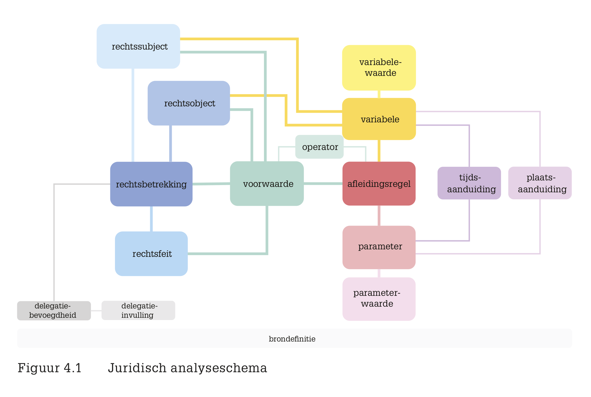

# Law analysis

> This is a summary of the book Wetsanalyse, Voor een werkbare uitvoering van wetgeving met ICT, by the author(s): Anouschka Ausems, John Bulles and Mariette Lokin.
>
> [This book](https://www.boomdenhaag.nl/webshop/wetsanalyse) is published by Boom publishers The Hague.

Legislation is an important instrument to keep society on the right track; it is not an end in itself but a means to achieve social goals.
In order to be able to implement legislation in an effective, lawful and explainable manner, the necessary steps must be taken. This is even more true if ICT applications are used in the implementation. Central government implementing organizations such as the Employee Insurance Agency, the Education Executive Agency and the Tax and Customs Administration now have extensive ICT landscapes to handle the ever-growing stream of decisions they make about citizens and businesses.

A good translation of legislation into implementation practice requires an approach in which all steps for interpreting, specifying and further fleshing out legislation are laid down explicitly and in a structured manner. This ensures that the choices made when translating legislation into implementation are clear and that decisions made on the basis of those choices can be explained and justified. Another advantage of such an approach is that it is easier to determine which adjustments are required in the ICT systems when legislation is amended. This makes implementing organizations more agile in the implementation of legislation.

Legal analysis is an approach that supports this; their description and application are central to this book. The book consists of two parts. The first part deals with the theory of Legal Analysis. In order to outline the context, Chapter 2 examines the characteristics of legislation that often make implementation (or setting up) laborious. Chapter 3 then describes the different steps in the legal analysis approach:

1. **Determining the working area** determining the scope of the legislation and the implementation policy to which Legal Analysis is applied, for example for building an ICT system or an implementation test on draft legislation.

2. **Making visible the structure in legislation** by identifying the legal 'grammar' of legislation using a legal analysis scheme.

3. **Determining the meaning of legislation** by defining the concepts for each formulation in the legislation with the corresponding properties and making concrete examples that clarify and sharpen the meaning of each concept.

4. **Validating the analysis results** Using concrete examples and legal scenarios, the analysis results from the previous steps are tested.

5. **Signaling missing implementation policy** Where interpretations and implementation aspects emerge that have not yet been laid down in the implementation policy, a signal is sent to those responsible so that this is done after all. This is essential for the legality of any decision or calculation. Everything must be traceable to legislation or officially established implementation policy.

6. **Preparing the knowledge model** supported by modeling skills, the meaning of the legislation and the implementation policy is clearly and coherently recorded in a model, so that this knowledge is available for implementation in implementation practice.

Chapter 4 deals with the legal analysis scheme that is used in Legal Analysis, in which various legal elements that occur in legislation are grouped together. These elements form the classes assigned to formulations in legislation in Legal Analysis. Classifying formulations into legal classes provides support in making the meaning of those formulations explicit. Chapter 5 examines the multidisciplinary collaboration between lawyers, information analysts and ICT developers that is essential for an optimal result of Legal Analysis. On the basis of concrete examples and scenarios, they always discuss the results of the analysis and the interpretation given to the legislation together. This is of great importance for the quality of the analysis and thus for the correctness of the ultimate implementation of the legislation. Chapter 5 also makes some recommendations for successful application and implementation of Legal Analysis.

The second part of the book consists of two large case studies showing the practical application of Legal Analysis. In Chapter 6, the income-related contribution in Article 43 Health Insurance Act (Zvw) elaborated. This contribution is levied by the tax authorities. An elaboration of the bill for the Modernization of electronic administrative traffic (section 2.3 Awb) has been chosen for chapter 7. This bill ensures that the rules for digital communication between citizens and government are adapted to the requirements of the times. These different case studies show that Legal Analysis can be applied to both general and domain-specific legislation, and to existing legislation as well as to legislation in the making.

The aim of this book is to make the legal analysis approach widely known to everyone who is involved in the application or implementation of legislation in their work or study. Although the emphasis is on digital implementation of legislation in government implementing organizations, it can also be of value in legal and information science education at colleges, universities and postgraduate courses. The aim is always to build a bridge between the language of lawyers and the technology of ICT.

## Invitation to contribute

The book describes the approach and application of Legal Analysis as of early 2021. However, Legal Analysis will continue to evolve under the influence of developments in legislation, application of law and technology. Readers are expressly invited to work with Wetsanalyse and to share experiences and ideas, in order to work together on refining and further developing Wetsanalyse. Just as cooperation is essential in the concrete application of Legal Analysis: always multidisciplinary and step by step.